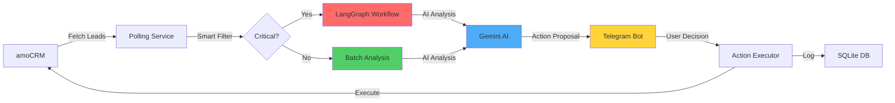

# 🤖 AI-Powered CRM Assistant

[](https://www.typescriptlang.org/)
[](https://nodejs.org/)
[](LICENSE)


An intelligent CRM automation system that uses **Google Gemini AI** and **LangGraph** to analyze leads from amoCRM and provide actionable insights via Telegram. Features a human-in-the-loop architecture to ensure critical business decisions remain under manager control.

## ✨ Key Features

### 🧠 AI-Powered Analysis
- **LangGraph Workflows**: Multi-step reasoning chains for complex lead analysis
- **Batch Processing**: Efficient analysis of multiple leads simultaneously
- **Smart Filtering**: Identifies high-priority leads that need attention
- **Risk Scoring**: Calculates deal loss risk based on activity patterns

### 📱 Telegram Integration
- **Interactive Cards**: Rich action proposals with approve/reject buttons
- **Natural Language Commands**: Understands plain text like "show hot leads"
- **Real-time Notifications**: Instant alerts for critical situations
- **Command Dashboard**: `/today`, `/hot`, `/risk`, `/stats` and more

### ⏰ Automated Reporting
- **Morning Digest** (9:00 AM): Daily overview of tasks and priorities
- **Evening Report** (6:00 PM): End-of-day summary
- **Weekly Overview** (Monday 10:00 AM): Week-in-review statistics

### 🔐 Human-in-the-Loop
- Manager approval required for all CRM actions
- Complete audit trail of all AI decisions
- Configurable risk thresholds and business rules

### 💾 Persistent Storage
- SQLite database for lead scores and action history
- Tracks score trends over time
- Searchable decision logs

---

## 🏗️ Architecture




### Key Components

- **Polling Service**: Monitors amoCRM for lead updates every 15 minutes
- **Smart Filter**: Budget-based priority scoring (VIP 500K+, Important 100K+, Medium 50K+)
- **LangGraph Workflow**: Multi-step AI reasoning for critical/stuck leads
- **Batch Analysis**: Efficient processing for normal leads
- **Telegram Bot**: Interactive UI for managers
- **Action Executor**: Safely executes approved actions in amoCRM

---

## 🛠️ Tech Stack

| Category | Technology |
|----------|------------|
| **Runtime** | Node.js 18+, TypeScript 5.7 |
| **AI/ML** | Google Gemini AI, LangGraph, AI SDK |
| **Database** | SQLite (better-sqlite3) |
| **APIs** | amoCRM REST API, Telegram Bot API |
| **Scheduling** | node-cron |
| **Validation** | Zod |

---

## 📦 Installation

### Prerequisites

- Node.js 18 or higher
- amoCRM account with API access
- Telegram bot token (from @BotFather)
- Google Gemini API key

### Setup Steps

1. **Clone the repository**
   ```bash
   git clone https://github.com/yourusername/crm-ai-agent.git
   cd crm-ai-agent
   ```

2. **Install dependencies**
   ```bash
   npm install
   ```

3. **Configure environment**
   ```bash
   cp .env.example .env
   ```

   Edit `.env` with your credentials:
   ```env
   # AI Configuration
   GOOGLE_GENERATIVE_AI_API_KEY=your_google_api_key
   TELEGRAM_BOT_TOKEN=your_telegram_bot_token
   MANAGER_TG_ID=your_telegram_user_id

   # amoCRM Configuration
   AMOCRM_SUBDOMAIN=your_subdomain
   AMOCRM_CLIENT_ID=your_client_id
   AMOCRM_CLIENT_SECRET=your_client_secret
   AMOCRM_REDIRECT_URI=http://localhost:3000

   # Agent Settings
   POLLING_INTERVAL_MS=900000  # 15 minutes
   ```

4. **Setup amoCRM authentication**
   ```bash
   npm run setup
   ```
   Follow the prompts to authorize the application.

5. **Start the agent**
   ```bash
   npm start
   ```

---

## ⚙️ Configuration

### Environment Variables

| Variable | Description | Default |
|----------|-------------|---------|
| `GOOGLE_GENERATIVE_AI_API_KEY` | Gemini API key | Required |
| `TELEGRAM_BOT_TOKEN` | Bot token from @BotFather | Required |
| `MANAGER_TG_ID` | Your Telegram user ID | Required |
| `ALLOWED_TG_IDS` | Comma-separated allowed user IDs | Optional |
| `AMOCRM_SUBDOMAIN` | Your amoCRM subdomain | Required |
| `AMOCRM_CLIENT_ID` | OAuth client ID | Required |
| `AMOCRM_CLIENT_SECRET` | OAuth client secret | Required |
| `POLLING_INTERVAL_MS` | Lead check frequency | 900000 (15 min) |
| `STUCK_LEAD_TIMEOUT_MS` | Threshold for stuck leads | 1800000 (30 min) |

### Smart Filter Thresholds

Modify in `src/index.ts`:

```typescript
// VIP - always requires attention
if (budget >= 500000) return true;

// Important - always requires attention  
if (budget >= 100000) return true;

// Medium - if no active tasks
if (budget >= 50000 && !hasActiveTasks) return true;
```

---

## 🚀 Usage

### Telegram Commands

| Command | Description |
|---------|-------------|
| `/start` | Activate the bot |
| `/today` | Daily dashboard (tasks + critical leads) |
| `/hot` | VIP and important clients (100K+) |
| `/risk` | Stuck leads (7+ days without activity) |
| `/week` | Weekly statistics overview |
| `/stats` | Agent performance metrics |

### Natural Language

The bot understands plain text:
- "show me hot leads" → triggers `/hot`
- "what's today's plan?" → triggers `/today`
- "which deals are stuck?" → triggers `/risk`

### Demo Scripts

Create test leads for development:

```bash
npm run demo:create-leads
```

---

## 📚 Documentation

- **[Testing Guide](docs/TESTING.md)** - Complete testing instructions
- **[AI Toolkit](docs/AI_TOOLKIT.md)** - AI integration patterns
- **[LangGraph Guide](docs/LANGGRAPH_GUIDE.md)** - Workflow architecture
- **[Security Checklist](docs/SECURITY_CHECKLIST.md)** - Security best practices
- **[Process Management](docs/PROCESS_MANAGEMENT.md)** - Running in production

---

## 🔒 Security

- ✅ No hardcoded credentials (all via environment variables)
- ✅ Telegram user ID whitelist
- ✅ Rate limiting on API calls
- ✅ Audit logging for all actions
- ✅ Human approval required for CRM modifications

See [SECURITY_CHECKLIST.md](docs/SECURITY_CHECKLIST.md) for details.

---

## 🧪 Testing

See the [Testing Guide](docs/TESTING.md) for comprehensive testing instructions including:
- Creating test leads
- Testing Telegram commands
- Scenario walkthroughs
- Troubleshooting

**Quick test:**
```bash
# Create demo leads
npm run demo:create-leads

# Start the bot
npm run dev

# Send /today to your bot in Telegram
```

---

## 📊 Database Schema

The agent uses SQLite with three main tables:

### `lead_scores`
Tracks risk scores over time
```sql
CREATE TABLE lead_scores (
    id INTEGER PRIMARY KEY,
    lead_id INTEGER,
    score INTEGER,
    risk_level TEXT,
    priority TEXT,
    calculated_at INTEGER
);
```

### `pending_actions`
Stores proposed actions awaiting approval
```sql
CREATE TABLE pending_actions (
    id INTEGER PRIMARY KEY,
    lead_id INTEGER,
    action_type TEXT,
    action_data TEXT,
    risk_score INTEGER,
    priority TEXT,
    reasoning TEXT,
    status TEXT,
    created_at INTEGER
);
```

### `decisions_log`
Complete audit trail
```sql
CREATE TABLE decisions_log (
    id INTEGER PRIMARY KEY,
    action_id INTEGER,
    decision TEXT,
    decided_by TEXT,
    decided_at INTEGER
);
```

---

## 🤝 Contributing

Contributions are welcome! Please feel free to submit a Pull Request.

1. Fork the repository
2. Create your feature branch (`git checkout -b feature/AmazingFeature`)
3. Commit your changes (`git commit -m 'Add some AmazingFeature'`)
4. Push to the branch (`git push origin feature/AmazingFeature`)
5. Open a Pull Request

---

## 📄 License

This project is licensed under the MIT License - see the [LICENSE](LICENSE) file for details.

---

## 🙏 Acknowledgments

- Built with [LangGraph](https://github.com/langchain-ai/langgraph) for agentic workflows
- Powered by [Google Gemini AI](https://ai.google.dev/)
- Uses [grammy](https://grammy.dev/) for Telegram integration
- amoCRM integration via [amocrm-js](https://github.com/UsefulWeb/amocrm-js)

---

## 📧 Contact

Created by [Your Name] - feel free to reach out!

- GitHub: [@Vision70s](https://github.com/Vision70s)
- Email: grepyday@gmail.com

---

<p align="center">Made with ❤️ for smarter CRM management</p>
